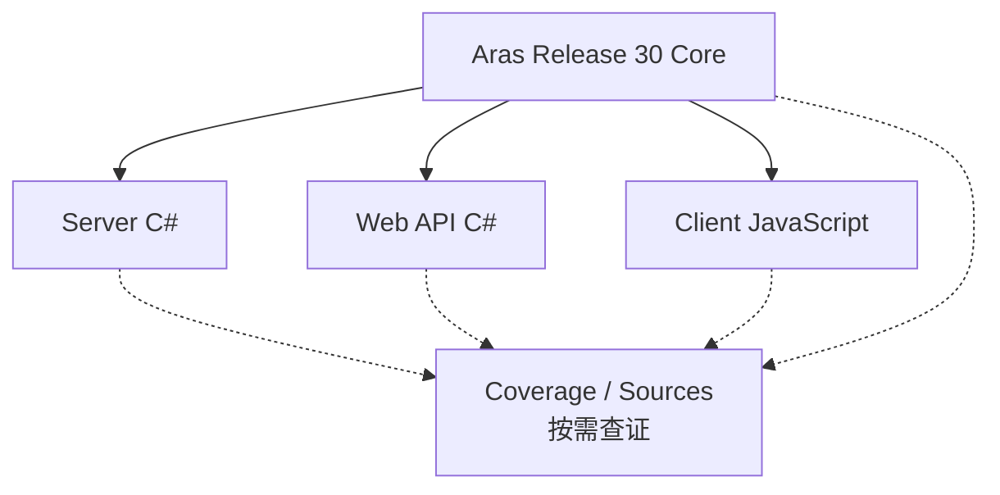

<h1 align="center">Aras Release 30 Expert Skills</h1>

<p align="center">
面向 Aras Innovator Release 30 的生产导向 Agent Skills<br>
AML · IOM · Server C# · Web API C# · Client JavaScript
</p>

<p align="center">
  <a href="https://github.com/zerohh77/Aras-PLM/actions/workflows/validate-skills.yml"></a>
  
  
  
  
  
</p>

这是一套分层、按需加载的 Aras 工程知识包，帮助 Codex 和 Claude Code 设计、实现、审查及诊断 Aras 定制与集成。它是社区工程辅助资料，不是 Aras 官方产品、认证或支持渠道。

## 兼容性

| 目标 | 范围 |
|---|---|
| Aras Innovator | **Release 30** |
| 精确构建 | **14.0.22.40048** |
| 专项实现 | Server C#、外部 Web API C#、Client JavaScript |

Release 30 专项结论不得泛化为所有 Aras 14.x 构建。更早材料只在明确标注的兼容性边界内使用。

## 知识架构



Core 负责平台事实与跨层边界；三个专业 Skill 负责各自运行时的实现指导；共享 Coverage/Sources 只在冷门、未决或高风险问题中按需读取。

## 包含内容

- `aras-release30-core`：平台语义、AML/IOM、版本、事件、生命周期、权限、事务、Workflow、Vault、安装和诊断。
- `aras-release30-server-csharp`：Server Method/Event、IOM 编码、关系、批处理、权限、事务、SQL 与运行时兼容性。
- `aras-release30-webapi-csharp`：外部 C# Web API 的 IOM 会话、HTTP 错误映射、身份、批处理、异步、文件与集成边界。
- `aras-release30-client-js`：Client Method、Form/Grid/Field/CUI 上下文、异步 UX、浏览器及 DOM/private API 边界。
- `COVERAGE.md`：已覆盖、部分覆盖、未决和未研究主题地图。
- `SOURCES.md`：官方资料与经验证实现观察的精简证据索引。

## 安装与使用

这是一个包含共享 `references/` 的 Skill bundle。请复制完整的 `skills/` 目录内容，不要只复制某个专业 Skill。

### Codex

```bash
git clone https://github.com/zerohh77/Aras-PLM.git
mkdir -p ~/.codex/skills
cp -R Aras-PLM/skills/* ~/.codex/skills/
```

重启 Codex 或开始新会话后，直接提出 Aras 任务即可自动匹配；也可显式使用 `$aras-release30-core` 等 Skill 名称。

### Claude Code

```bash
git clone https://github.com/zerohh77/Aras-PLM.git
mkdir -p ~/.claude/skills
cp -R Aras-PLM/skills/* ~/.claude/skills/
```

项目级安装可将同一 bundle 复制到 `.claude/skills/`。Claude Code 使用 `SKILL.md` 和 references，并忽略 Codex 专用的 `agents/openai.yaml`。

## Skill 路由示例

```text
使用 aras-release30-core 诊断 OAuth discovery 正常但客户端登录失败的问题。
使用 aras-release30-server-csharp 审查这个 Server Method 的权限、事务和错误处理。
使用 aras-release30-webapi-csharp 设计请求级 IOM 会话、身份映射和批量写入边界。
使用 aras-release30-client-js 审查 Relationship Grid Method 的上下文和异步行为。
```

自动路由保持启用：平台与跨层问题进入 Core；具体实现进入对应专业 Skill；普通编码不默认加载共享证据索引。

## 证据模型与覆盖边界

- 官方 Release 30 资料优先于第三方总结、培训材料和项目观察。
- 精确版本事实、较宽泛官方事实、实现观察及未决结论保持不同置信边界。
- `.NET 6.0` 运行时不等于已确认的 C# 编译器语言版本；外部 Web API 运行时也不能从服务器运行时推断。
- Hotfix `068423.00` 已索引，但未把未经公告或运行时验证的影响写成确定规则。
- 仓库不包含原始 PDF、PPTX、DOCX 或第三方网页副本。
- 详细状态见 [`skills/references/COVERAGE.md`](skills/references/COVERAGE.md)，证据索引见 [`skills/references/SOURCES.md`](skills/references/SOURCES.md)。

## 校验

GitHub Actions 会在 push 和 pull request 时执行只读检查，包括 Skill/frontmatter 元数据、相对链接、目录结构、公开仓库卫生、过期 Skill 名称以及意外许可证声明。

本地运行：

```bash
python3 -m pip install PyYAML
python3 scripts/validate_skills.py
```

## 仓库结构

```text
skills/
├── aras-release30-core/
│   ├── SKILL.md
│   ├── agents/openai.yaml
│   └── references/
├── aras-release30-server-csharp/
│   ├── SKILL.md
│   └── agents/openai.yaml
├── aras-release30-webapi-csharp/
│   ├── SKILL.md
│   └── agents/openai.yaml
├── aras-release30-client-js/
│   ├── SKILL.md
│   └── agents/openai.yaml
└── references/
    ├── COVERAGE.md
    └── SOURCES.md
```

## 贡献与发布准备

- 保持 Release 30 / build `14.0.22.40048` 的证据边界，不把观察扩展为通用平台保证。
- 修改后运行仓库校验；技术规则变化必须具备对应证据并同步覆盖与来源索引。
- 创建未来 `v1.0.0` 标签前，应确保 CI 通过、工作树干净，并人工复核公开仓库内容；本仓库目前不会自动创建发布。

Aras 和 Aras Innovator 是其各自权利人的商标。
